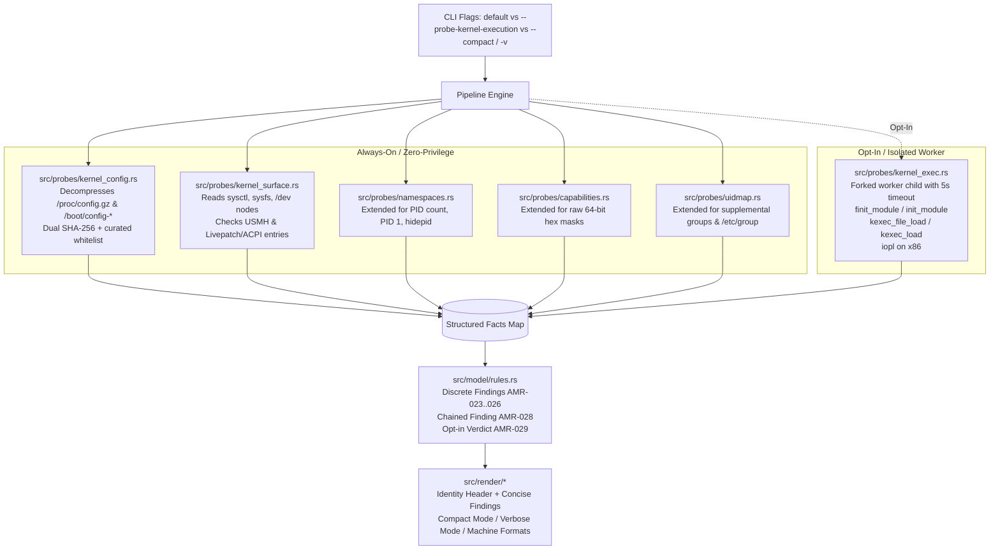

# Design Specification: Kernel-Mode Execution Attack Surface & UX Overhaul

- **Date:** 2026-10-05
- **Author:** bdawg / amirustrained contributors
- **Status:** Draft / Approved by Human Partner
- **Target Release:** v0.2.0

---

## 1. Executive Summary

This specification introduces comprehensive audit capabilities for **standard, supported Linux kernel-mode (Ring 0) and host-level execution transition surfaces**, along with a **major UX and output overhaul** designed to provide immediate identity context and clean, diffable output for privilege escalation verification.

### Key Additions
1. **Passive Kernel Configuration Discovery & Whitelist Parsing:**
   - Pure-Rust decompression (`flate2`/`miniz_oxide`) of `/proc/config.gz` and parsing of `/boot/config-$(uname -r)` and `/proc/config`.
   - Dual SHA-256 calculation (raw artifact SHA-256 and canonical uncompressed text SHA-256).
   - Curated security whitelist extraction (`CONFIG_MODULES*`, `CONFIG_KEXEC*`, `CONFIG_DEVMEM*`, `CONFIG_LIVEPATCH`, `CONFIG_ACPI_CUSTOM_METHOD`, `CONFIG_LOCKDOWN*`, etc.).
2. **Passive Runtime Attack Surface Inspection:**
   - Sysctl / sysfs state (`modules_disabled`, `kexec_load_disabled`, `kexec_loaded`, `lockdown`).
   - Device node accessibility (`/dev/mem`, `/dev/kmem`, `/dev/port`).
   - User-Mode Helper (USMH) injection paths (`core_pattern`, `modprobe`).
   - Kernel extension points (`/sys/kernel/livepatch`, `/sys/kernel/config/acpi/table`).
3. **Active Kernel Execution Boundary Probing (`--probe-kernel-execution`, alias `--probe-kernel`):**
   - Forked worker child process isolated by a 5-second deadline.
   - Non-destructive, kernel-validated boundary syscalls: `finit_module(-1)`, `init_module(NULL)`, `kexec_file_load(-1)`, `kexec_load(ULONG_MAX)`, and `iopl(3)` (x86_64 only).
4. **Discrete & Chained Rule Evaluation (`AMR-023` through `AMR-029`):**
   - Discrete findings for modules, kexec, memory/IO, USMH, and ACPI.
   - Chained escalation finding (`AMR-028`): flags unconstrained kexec as a bypass for disabled module loading, suppressed when direct module loading is already open.
   - Opt-in feedback guarantee (`AMR-029`): ensures opt-in CLI runs never exit silently when all entry points are closed.
5. **UX Overhaul & Output Philosophy:**
   - Silence `probe <name>: ok` progress noise in default human output (moved to `--verbose`; degraded probes log concise warnings to stderr).
   - Standard **Environment & Identity Header**: UID/GID, supplemental groups with privileged GID mapping, 64-bit hexadecimal capabilities mask + mnemonics, sandboxing status, and PID namespace visibility.
   - `--compact` single-line finding mode for instant diffability across privilege states.
   - Repo-wide architectural contract documented in `AGENTS.md`.

---

## 2. Architecture & Data Flow



---

## 3. Component Specifications

### 3.1 Kernel Config Probe (`src/probes/kernel_config.rs`)
- **Sources Evaluated (first readable wins):**
  1. `/proc/config.gz` (read and decompressed via `flate2::read::GzDecoder` backed by `miniz_oxide`).
  2. `/boot/config-$(uname -r)` (plain UTF-8 text).
  3. `/proc/config` (plain UTF-8 text).
- **Hashing:**
  - `raw_sha256`: SHA-256 of the exact bytes read from disk/procfs.
  - `uncompressed_sha256`: SHA-256 of the uncompressed text normalized with LF newlines.
- **Whitelist Extracted into `kernel.config.options`:**
  - Modules: `CONFIG_MODULES`, `CONFIG_MODULE_UNLOAD`, `CONFIG_MODULE_SIG`, `CONFIG_MODULE_SIG_FORCE`, `CONFIG_MODULE_SIG_ALL`.
  - Kexec: `CONFIG_KEXEC`, `CONFIG_KEXEC_FILE`, `CONFIG_KEXEC_SIG`, `CONFIG_KEXEC_SIG_FORCE`.
  - Memory & Port I/O: `CONFIG_DEVMEM`, `CONFIG_STRICT_DEVMEM`, `CONFIG_IO_STRICT_DEVMEM`, `CONFIG_DEVKMEM`.
  - Hardening & LSMs: `CONFIG_SECURITY_LOCKDOWN_LSM`, `CONFIG_SECURITY_LOCKDOWN_LSM_EARLY`, `CONFIG_LOCK_DOWN_KERNEL_FORCE_NONE`, `CONFIG_LOCK_DOWN_KERNEL_FORCE_INTEGRITY`, `CONFIG_LOCK_DOWN_KERNEL_FORCE_CONFIDENTIALITY`, `CONFIG_SECURITY_LANDLOCK`, `CONFIG_SECURITY_APPARMOR`, `CONFIG_SECURITY_SELINUX`.
  - Kernel Extensions: `CONFIG_LIVEPATCH`, `CONFIG_ACPI_CUSTOM_METHOD`, `CONFIG_BPF_SYSCALL`, `CONFIG_USER_NS`.

### 3.2 Kernel Surface Probe (`src/probes/kernel_surface.rs`)
Passive, always-on inspection of runtime kernel knobs:
- `/proc/sys/kernel/modules_disabled` (`0` = enabled, `1` = permanently disabled).
- `/proc/sys/kernel/kexec_load_disabled` (`0` = enabled, `1` = permanently disabled).
- `/sys/kernel/kexec_loaded` (`0` = no image, `1` = kexec image loaded).
- `/sys/kernel/security/lockdown` (reads active bracketed status: `none`, `integrity`, `confidentiality`).
- `/dev/mem`, `/dev/kmem`, `/dev/port` (stat for character device presence, permissions, and test non-blocking open).
- `/proc/sys/kernel/core_pattern` and `/proc/sys/kernel/modprobe` (check write permissions from current user namespace).
- `/sys/kernel/config/acpi/table` and `/sys/kernel/livepatch` (check presence and writability).

### 3.3 Active Kernel Execution Probe (`src/probes/kernel_exec.rs`)
Runs **only** when `--probe-kernel-execution` (or `--probe-kernel`) is provided.
- **Process Model:** Calls `fork()`. Parent monitors child with a 5-second deadline via pipe/socketpair.
- **Boundary Syscalls:**
  - `finit_module(-1, "", 0)`:
    - `Err(EBADF)` $\implies$ Subsystem enabled, caller authorized with `CAP_SYS_MODULE`.
    - `Err(EPERM)` $\implies$ Denied by capability check, `modules_disabled`, or lockdown.
    - `Err(ENOSYS)` $\implies$ `CONFIG_MODULES=n` or seccomp blocked.
  - `init_module(NULL, 0, "")`:
    - `Err(ENOEXEC)` or `Err(EFAULT)` $\implies$ Authorized by kernel.
    - `Err(EPERM)` $\implies$ Denied.
  - `kexec_file_load(-1, -1, 0, NULL, 0)`:
    - `Err(EBADF)` $\implies$ Authorized with `CAP_SYS_BOOT`, lockdown off/permissive.
    - `Err(EPERM)` $\implies$ Denied.
    - `Err(ENOSYS)` $\implies$ `CONFIG_KEXEC_FILE=n`.
  - `kexec_load(0, ULONG_MAX, NULL, 0)`:
    - `Err(EINVAL)` $\implies$ Authorized with `CAP_SYS_BOOT`.
    - `Err(EPERM)` $\implies$ Denied.
    - `Err(ENOSYS)` $\implies$ `CONFIG_KEXEC=n`.
  - `iopl(3)` (x86_64 only):
    - `Ok(0)` $\implies$ Raw port I/O granted.
    - `Err(EPERM)` $\implies$ Missing `CAP_SYS_RAWIO` or locked down.
    - Non-x86 architectures record `unsupported_arch`.

---

## 4. Rule Engine & Finding Model

### 4.1 Discrete Findings

| Rule ID | Identifier | Severity | Trigger Invariants |
| :--- | :--- | :--- | :--- |
| **`AMR-023`** | `kernel-module-loading-permitted` | **High** | Holds `CAP_SYS_MODULE` + `modules_disabled == 0` + (`finit_module`/`init_module` permitted OR config `CONFIG_MODULES=y` with no forced sigs). |
| **`AMR-024`** | `kexec-kernel-replacement-permitted` | **High** | Holds `CAP_SYS_BOOT` + `kexec_load_disabled == 0` + (`kexec_load` or `kexec_file_load` permitted). |
| **`AMR-025`** | `raw-memory-access-permitted` | **Critical** | `/dev/mem` or `/dev/kmem` openable for write with lockdown off, OR `iopl(3)` returned `Ok(0)`. |
| **`AMR-026`** | `user-mode-helper-writable` | **High** | `/proc/sys/kernel/core_pattern` or `modprobe` is writable from caller's namespace. |
| **`AMR-027`** | `acpi-table-injection-writable` | **High** | `/sys/kernel/config/acpi/table` exists and is writable (`CONFIG_ACPI_CUSTOM_METHOD=y`). |

### 4.2 Chained Escalation Finding (`AMR-028`)
- **Identifier:** `kexec-module-lockdown-bypass`
- **Severity:** **High**
- **Trigger Conditions:**
  1. Direct module loading is **CLOSED** (`AMR-023` does NOT fire: e.g. `CONFIG_MODULES=n`, `modules_disabled=1`, `module.sig_enforce=1`, or active probe denied).
  2. Kexec replacement is **OPEN** (`AMR-024` fires: `CAP_SYS_BOOT`, lockdown off, syscall permitted).
- **Suppression Invariant:** If direct module loading is **OPEN** (`AMR-023` fires), `AMR-028` is **strictly suppressed** to eliminate redundant noise (direct Ring 0 is already reported).

### 4.3 Opt-In Execution Report Finding (`AMR-029`)
- **Identifier:** `kernel-execution-probe-report`
- **Severity:** **Info**
- **Trigger Conditions:** `--probe-kernel-execution` was specified on CLI, but **none** of `AMR-023..027` fired (all Ring 0 pathways verified closed). Emits explicit human-visible confirmation that module loading, kexec, and raw memory access were actively tested and confirmed denied.

---

## 5. UX Overhaul & Output Formatting

### 5.1 Environment & Identity Header
Every human scan begins with a concise, high-density context header before findings:
```text
Host:       Linux 6.8.0-142-generic (x86_64) | distro: Ubuntu 22.04.4 LTS | runtime: host (confidence high)
Identity:   uid=0(root) gid=0(root) groups=0(root),10(wheel),998(docker)
Caps:       000001ffffffffff (all 41 caps) [eff=000001ffffffffff bnd=000001ffffffffff inh=0000000000000000]
Sandboxing: no_new_privs=0 seccomp=0(disabled) lockdown=none
Visibility: pid_ns=isolated (59 procs visible, pid 1="/sbin/fireworks-init", procfs hidepid=0)
```

- **Supplemental Groups:** Cross-references `/etc/group` when readable; highlights privileged memberships (`root`, `wheel`, `sudo`, `docker`, `lxd`, `disk`).
- **Kernel, CPU Arch & Distro:**
  - Captures `rustix::system::uname().machine()` (e.g. `x86_64`, `aarch64`, `riscv64`) into `ReportMeta.arch`.
  - Captures `rustix::system::uname().release()` into `ReportMeta.kernel`.
  - Parses `/etc/os-release` (fallback `/usr/lib/os-release`) for `PRETTY_NAME` (fallback `NAME + " " + VERSION_ID`) into `ReportMeta.distro: Option<String>`.
  - Displayed prominently in the `Host:` header and exported to all machine formats (`scan.kernel`, `scan.arch`, `scan.distro`).
- **Caps Hex:** Raw 64-bit hexadecimal mask displayed alongside capability count for instant diffing.
- **Process Visibility:** Displays total visible PID count, PID 1 command-line, and `/proc` `hidepid` mount status.
### 5.2 Silence Probe Progress Noise
- In standard human output, all `probe <name>: ok` lines are **suppressed**.
- Degraded states (e.g. `probe namespaces: degraded: pid 1 namespaces unreadable`) emit a single-line muted notice to stderr.
- `--verbose` restores full `probe <name>: ok` progress lines and dumps complete kernel config hashes and option tables.

### 5.3 Diffable Single-Line Mode (`--compact`, alias `--terse`)
CLI flag `--compact` (with alias `--terse`) switches the finding presentation to one line per finding:
```text
HIGH     AMR-023 kernel-module-loading-permitted: finit_module permitted (CAP_SYS_MODULE, modules_disabled=0)
CRITICAL AMR-025 raw-memory-access-permitted: /dev/mem writable (lockdown=none)
INFO     AMR-012 landlock-abi-available: ABI 10
```
This enables `diff -u before.txt after.txt` to clearly show gained privileges and new findings after executing an exploit or container escape.

---

## 6. Architecture & Machine Output Contract (`AGENTS.md`)

A repository-level `AGENTS.md` file will permanently codify these tenets:
1. **Human Output is Opinionated and Concise:** Default terminal rendering emphasizes findings and identity posture. Bulky hashes, full configuration trees, and progress heartbeats are deferred to `--verbose`.
2. **Machine Formats are Exhaustive:** JSON, YAML, and SARIF streams must always include complete metadata (raw and uncompressed SHA-256 hashes, full parsed config options, detailed per-syscall errno measurements, and chain dependency status).
3. **Opt-in Expressiveness Guarantee:** Any opt-in flag (`--probe-*`) MUST produce visible feedback in both human and machine modes explaining the exact outcome of the tested surface, even when the verdict is negative or closed.
4. **Non-Destructive Boundary Probing:** Active probes must exclusively invoke kernel-validated boundary arguments that reject state mutation after verifying capabilities and LSMs.

---

## 7. Testing Strategy

1. **Unit Tests:**
   - In-memory gzip decompression test using synthetic `/proc/config.gz` streams.
   - Dual SHA-256 calculation tests against golden fixture bytes.
   - Kernel config key-value parser tests (handling `# CONFIG_FOO is not set`, comments, whitespace, and quoted values).
   - Identity header formatting and hex bitmask formatting tests.
2. **Fixture-Driven Scenario Tests (`tests/scenarios.rs`):**
   - New scenario fixtures simulating various kernel security states:
     - `monolithic-kernel`: `/proc/modules` absent, `CONFIG_MODULES=n` in config, kexec enabled. Asserts `AMR-028` fires and `AMR-023` does not.
     - `locked-down-kernel`: `lockdown=integrity`, `CONFIG_KEXEC_SIG_FORCE=y`, `/dev/mem` unopenable. Asserts `AMR-024` and `AMR-025` do NOT fire.
     - `hardened-microvm`: `modules_disabled=1`, `kexec_load_disabled=1`, unprivileged user. Asserts `AMR-029` fires under `--probe-kernel-execution`.
3. **Live Smoke Tests:**
   - Execute on the host workstation and in test containers to verify clean, non-noisy terminal output, correct identity headers, and safe active probe execution.
